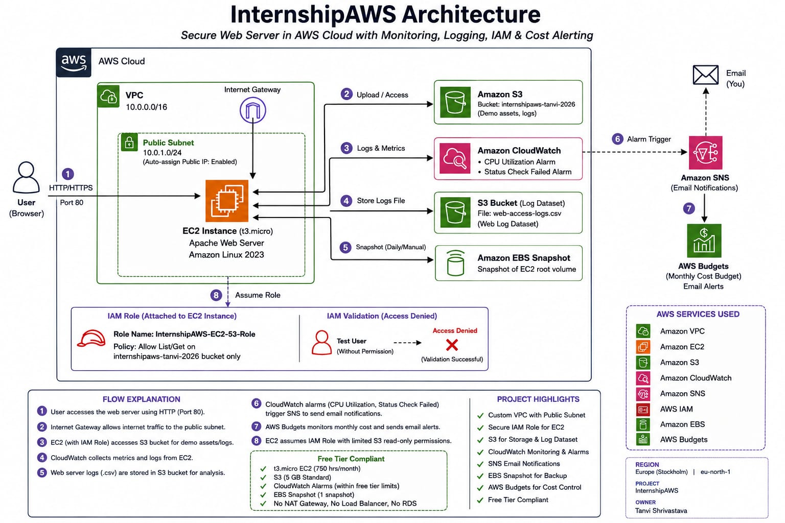
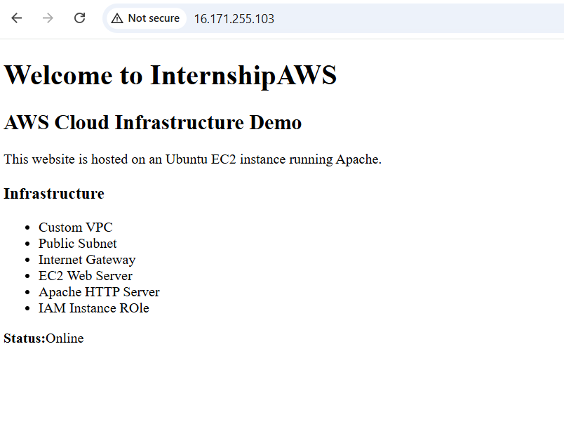
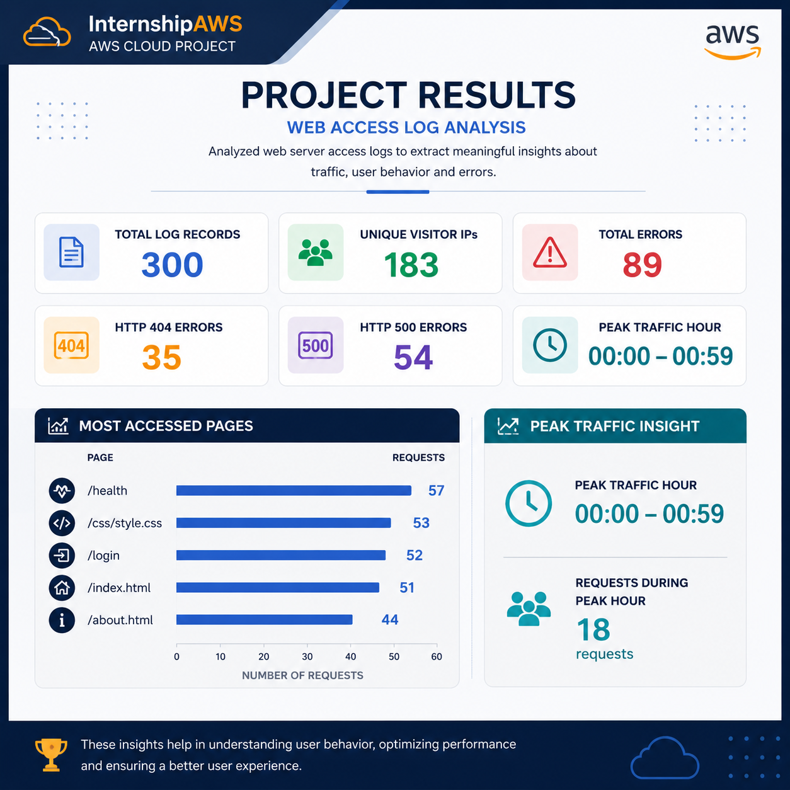
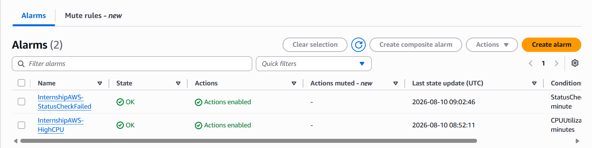
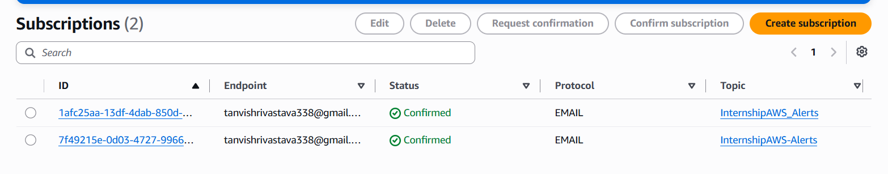
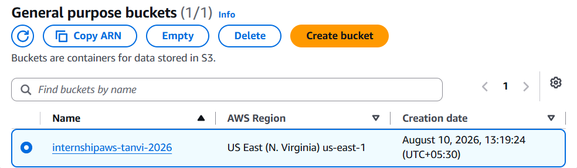

# ☁️ InternshipAWS — AWS Cloud Infrastructure Project

A hands-on AWS cloud project focused on deploying, monitoring, securing, and managing a web application using core AWS services.

## 📌 Project Overview

InternshipAWS demonstrates the deployment of a web application on an Ubuntu EC2 instance with supporting AWS infrastructure for networking, storage, identity management, monitoring, notifications, backups, and cost control.

## 🏗️ Architecture

### AWS Services Used

- **Amazon VPC** — Network isolation and configuration
- **Amazon EC2** — Web server hosting
- **Amazon S3** — Object storage
- **AWS IAM** — Identity and access management
- **Amazon CloudWatch** — Monitoring and alarms
- **Amazon SNS** — Email notifications
- **Amazon EBS** — Snapshot and backup
- **AWS Budgets** — Cost monitoring

## 🌐 Web Application

The web application was deployed on an **Ubuntu 24.04 LTS EC2 instance** using the Apache HTTP Server.

## 📊 Log Analysis Results

A dataset containing **300 web-access log records** was analyzed.

| Metric | Result |
|---|---:|
| Total records | **300** |
| Unique visitor IPs | **183** |
| Total errors | **89** |
| HTTP 404 errors | **35** |
| HTTP 500 errors | **54** |
| Peak traffic hour | **00:00–00:59** |
| Requests during peak hour | **18** |

### Most Accessed Pages

- `/health` — **57**
- `/css/style.css` — **53**
- `/login` — **52**
- `/index.html` — **51**
- `/about.html` — **44**

## 📈 Monitoring & Alerting

CloudWatch alarms were configured to monitor the EC2 environment, with SNS used for email notifications.

## 🪣 Storage

Amazon S3 was used for project-related object storage.

## 🔐 Security & Cost Management

The project included:

- IAM-based access control
- Least-privilege permissions
- EC2 IAM role
- AWS Budget alert
- Free Tier safety practices
- EBS snapshot for backup

## 🎯 Key Learning Outcomes

Through this project, I gained hands-on experience with:

- AWS cloud infrastructure
- VPC networking
- EC2 deployment
- Linux and Apache
- IAM and access control
- S3 storage
- CloudWatch monitoring
- SNS notifications
- Log analysis
- EBS snapshots
- Cloud cost management

## 🎥 Project Explanation Video

**Coming soon / Add your video link here**

## 👩‍💻 Project

**InternshipAWS**

Built and implemented as a hands-on AWS cloud project.
